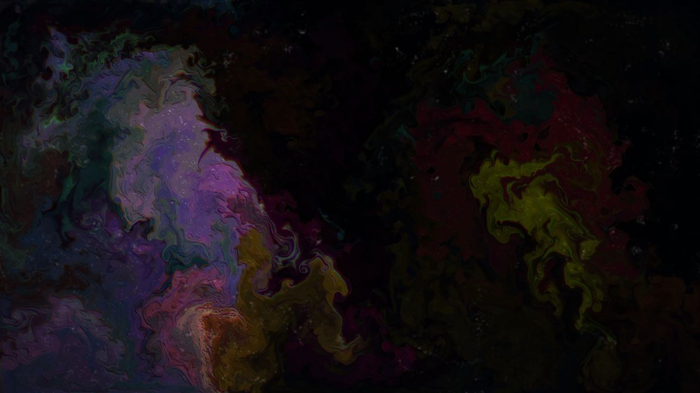
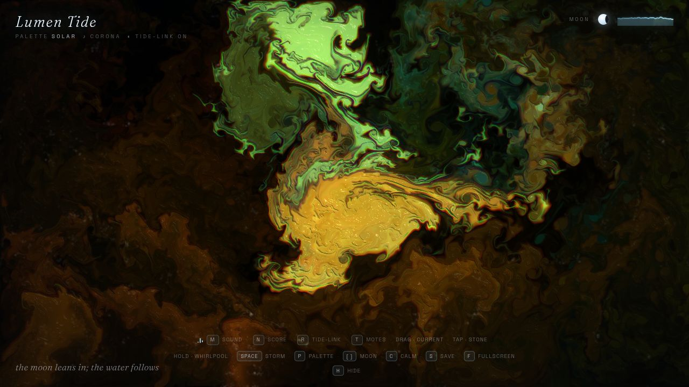
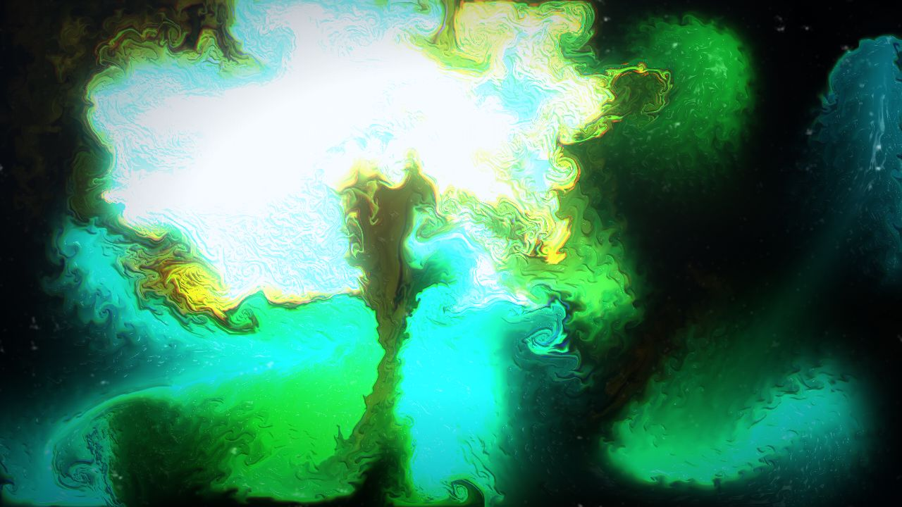
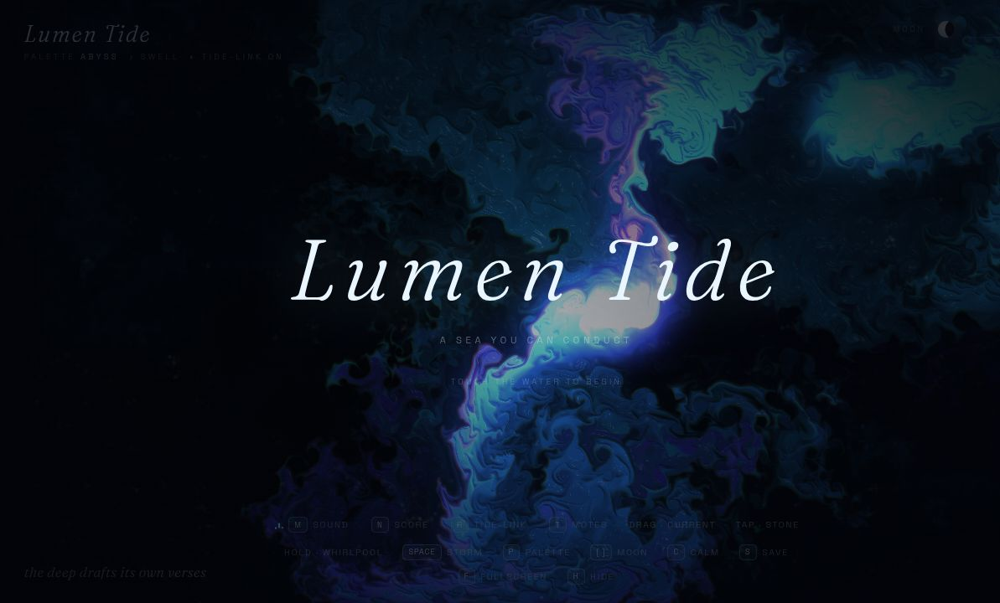

# Lumen Tide — a sea you can conduct

One self-contained HTML file: a real-time WebGL 2 fluid and a generative Web Audio score,
wired to each other. The water you paint makes the music, and the music stirs the water.

Open `index.html` and touch the water.

## The twist

Built as a study of `https://miaai-lab.github.io/Claude-Fable-5.1-Beautiful-HTML/`
("Synesthesia — a fluid you can hear": a fluid you listen to). Lumen Tide keeps that single-domain
premise — fluid plus sound in one file, no build step — but is otherwise entirely original work:
its own theme, typography, palettes, shaders, synthesis code, and interface.

Where the reference piece plays a score *at* you, Lumen Tide treats the sea as an instrument you
conduct, and adds:

- **Bioluminescent motes** — 4096 instanced quads (48×48 on mobile) advected on the velocity field
  inside a fragment shader, ping-ponged between two `RGBA32F` position textures. Their glow follows
  local water speed, so still water stays dark and moving water lights up.
- **Tide-Link** — an FFT analyser taps the master bus, splits it into bass/mid/high band energy, and
  feeds that energy back into splat force, bloom, drifters and mote brightness. The score genuinely
  conducts the sea, not a fake ambient loop.
- **A gestural vocabulary** — drag draws a current, a tap drops a stone and rings, a held press opens
  a whirlpool that spins faster the longer you hold, a double click (or Space) calls a storm.
- **A moon dial** — `[` and `]` move the phase, which drives the display shader's specular sheen,
  the iridescence spread and how quickly dye fades.
- **Drifters** — three slow wandering painters (two on mobile or under `prefers-reduced-motion`) keep
  the sea alive when nobody is conducting.
- **A tide log** — short poetic lines that answer what you just did, plus an energy sparkline and a
  baton cursor that swells with the music.
- **Five original score modes** — Swell, Undertow, Trench, Corona, Silence. Each has its own root
  note, scale, filter voicing and scheduler; chords, plucks and bells are synthesised, not sampled.
- **Six palettes** — Abyss, Plankton, Coral, Moonlit, Solar, Iris.
- **PNG capture** — `S` encodes the live frame and saves it.

## Gallery









Every frame was captured from the running piece with `S` at 1280×720.

## Controls

| Input | Effect |
| --- | --- |
| drag | paint a current along your stroke |
| tap / click | drop a stone; expanding rings |
| hold still | open a whirlpool (tightens and accelerates with hold time) |
| double click, `Space` | storm: flash, spin, scatter, crash |
| `M` | sound on / off |
| `N` | next score mode |
| `R` | tide-Link on / off |
| `T` | motes awake / asleep |
| `P`, `1`–`6` | next palette / palette by number |
| `[`, `]` | moon phase down / up |
| `C` | calm the sea |
| `S` | save the current frame as PNG |
| `H` | hide the interface (full-bleed) |
| `F` | fullscreen |

The same gestures work with touch and pen; multi-touch streams are tracked independently. The HUD
buttons mirror every key above.

## Requirements and graceful failure

- WebGL 2 with float rendering: `EXT_color_buffer_float`, or `EXT_color_buffer_half_float` as a
  fallback, plus `OES_texture_float_linear`. Buffers are probed by actually building one, so
  unsupported formats degrade rather than black-screen.
- If WebGL 2 or float buffers are unavailable, a "Lumen Tide needs WebGL 2" panel explains it and the
  script stops instead of throwing.
- Audio obeys the autoplay policy: the context is created on your first gesture, and every later
  gesture, keypress and return-to-tab retries `resume()`, so the score never stays stranded in
  `suspended`.
- Optional audio nodes and parameters are feature-guarded (`createAnalyser`, the compressor's
  `makeupGain`, `attack`, `release` are set through a small `setP` helper inside `try`/`catch`). An
  engine that lacks one of them loses that garnish, not the whole audio graph.
- No libraries and no scripts are fetched. The only network reference is a Google Fonts stylesheet for
  Fraunces and Space Grotesk, with complete local fallback stacks behind each family, so the file
  renders offline too.

## Debug hooks for automation

Append `?debug=1`:

- `window.__lumen` exposes `{ Sound, CFG, palettes, report }`.
- `<html data-lumen-debug>` mirrors `report()` as JSON every 250 ms — moon phase, tide-Link, motes,
  palette, score, audio state and sample rate, and band energy.
- `<html data-lumen-shot>` records the last capture as JSON: the 30-character head of the produced
  href, its length, and the file name. Verified output begins `data:image/png;base64,iVBORw0K` (the
  `iVBORw` prefix decodes to the PNG signature) at roughly 1.4 million characters for a 1280×720 frame.

Both attributes are readable from isolated script worlds, which is what makes them useful to tests and
browser agents.

## Serving it

Any static server works, and so does opening the file directly. Over HTTP keeps audio and fullscreen
happiest:

```sh
cd lumen-tide
python3 -m http.server 8791 -b 127.0.0.1
# then open http://127.0.0.1:8791/index.html
```

Quality scales by device: desktop runs the simulation at 192 and the dye at 1180 with 22 pressure
iterations, mobile drops to 128 / 620 / 14 and a smaller mote field. Observed at a steady 60 fps.

## Files

- `index.html` — the piece. Everything is inline: markup, CSS, GLSL and JavaScript.
- `README.md` — this file.
- `shots/` — five frames: `01-idle`, `06-tuned-plankton`, `10-hero-iris`,
  `11-hero-solar-corona`, `12-hero-plankton-storm`.
- `shots/_process/` — intermediate frames from the tuning pass; kept locally, ignored by git.
- `.nojekyll` — empty; tells Pages to copy files verbatim instead of building with Jekyll.

## Known edges

- `F` and the download from `S` can be suppressed by embedded webviews that own those privileges; the
  PNG still encodes (see the debug mirror above).
- Sustained pointer holds are hard for some automation harnesses to simulate, so the whirlpool code
  path is shared with the storm through one `applyVortex` primitive and is covered by `Space`.


## Publishing to GitHub Pages

The folder is Pages-ready as it stands: `index.html` sits at the repository root, and `.nojekyll`
makes Pages copy the bytes verbatim rather than run the folder through Jekyll. That second part
matters here — without it Jekyll silently skips every name beginning with an underscore, which would
drop the whole `shots/_process/` directory from the published site.

Once Pages is enabled for `main` at the repository root, the piece lives at:

```
https://paragontasx.github.io/lumen-tide/
```

First deploys take a minute or two, and Pages caches hard afterwards. When iterating, force a fresh
fetch with a throwaway query string such as `?v=2` rather than waiting on the cache.

The Google Fonts link resolves fine over Pages; open the file locally or offline and the fallback
font stacks in `--serif` and `--sans` carry the typography instead.
